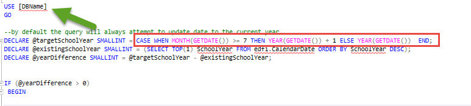

# Ed-Fi Sample Data Time Travel Script

These scripts were made possible thanks to the Michael and Susan Dell
Foundation.

## Description

This very simple SQL script updates the Populated Template of any MS SQL ODS
database to the most recent school year and dates related to it.

## Prerequisites

* Sql Server Manangement Studio (SSMS)
* An Ed-Fi ODS Populated Template Database
* Choose which script to run: with or without transaction support.
  * ❗ The script _with_ transaction support will take significantly longer to
    run, and you should make sure that your database has the right recovery
    model and does not have unlimited log growth. Good to take a backup first as
    well, to truncate the existing log.
  * ❕ If you run the script _without_ transaction support, be warned that you'll
    want to restore from backup if any errors occur.

## Setup Instructions

1. Open SQL Server Management Studio
2. From the **File** menu, go to  **Open -> File**, browse for the location of
  the t-sql script in your computer and open it. \
  
3. Replace the **[DBName]** with the actual name of the target Database. \
  
4. If you intend to upgrade the ODS data to a year other than current school
  year, please set the value of **@targetSchoolYear** to the desired School Year. \
  
5. Execute the script.

## Legal Information

Copyright (c) 2020 Ed-Fi Alliance, LLC and contributors.

Licensed under the [Apache License, Version 2.0](LICENSE) (the "License").

Unless required by applicable law or agreed to in writing, software distributed
under the License is distributed on an "AS IS" BASIS, WITHOUT WARRANTIES OR
CONDITIONS OF ANY KIND, either express or implied. See the License for the
specific language governing permissions and limitations under the License.
